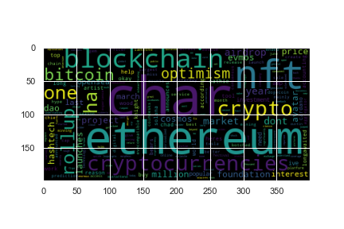
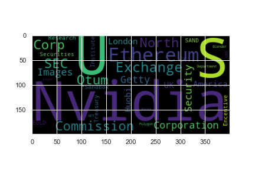

# Unit 12—Tales from the Crypto

## Background

There's been a lot of hype in the news lately about cryptocurrency, so you want to take stock, so to speak, of the latest news headlines regarding Bitcoin and Ethereum to get a better feel for the current public sentiment around each coin.

In this assignment, you will apply natural language processing to understand the sentiment in the latest news articles featuring Bitcoin and Ethereum. You will also apply fundamental NLP techniques to better understand the other factors involved with the coin prices such as common words and phrases and organizations and entities mentioned in the articles.

Complete the following tasks:

1. [Sentiment Analysis](#1---Sentiment-Analysis)
2. [Natural Language Processing](#2---Natural-Language-Processing)
3. [Named Entity Recognition](#3---Named-Entity-Recognition)

---

## Files

[Starter Notebook](Starter_Code/crypto_sentiment.ipynb)

---

## Instructions

### 1 - Sentiment Analysis

Use the [newsapi](https://newsapi.org/) to pull the latest news articles for Bitcoin and Ethereum and create a DataFrame of sentiment scores for each coin.

Use descriptive statistics to answer the following questions:

> See plots for information about daily Sentiment score

### 2 - Natural Language Processing

In this section, you will use NLTK and Python to tokenize text, find n-gram counts, and create word clouds for both coins. 

#### N-grams

Next, look at the ngrams and word frequency for each coin.

1. Use NLTK to produce the ngrams for N = 2, Top 10:
    
    
    A. Bitcoin
    * ('interest_rate', 4)
    * ('us_stock', 3)
    * ('digital_currency', 3)
    * ('may_reuters', 3)
    * ('rising_interest', 3)
    * ('us_treasury', 2)
    * ('elon_musk', 2)
    * ('bitcoin_news', 2)
    * ('job_report', 2)
    * ('ugandas_central', 2)
    
    B. Ethreum:
    * ('char_nvidia', 3),
    * ('failing_disclose', 2),
    * ('accept_cryptocurrency', 2),
    * ('fine_cryptomining', 2),
    * ('huobi_research', 2),
    * ('nvidia_million', 2),
    * ('crypto_mining', 2),
    * ('mixing_service', 2),
    * ('service_used', 2),
    * ('used_north', 2

2. List the top 10 words for each coin:

    A. Bitcoin
    * ('bitcoin', 24),
    * ('char', 20),
    * ('central', 10),
    * ('republic', 8),
    * ('african', 7),
    * ('cryptocurrencies', 6),
    * ('official', 5),
    * ('currency', 5),
    * ('reuters', 5),
    * ('market', 5)
    
    B. Ethreum:
    * ('char', 20),
    * ('ethereum', 14),
    * ('nft', 8),
    * ('cryptocurrencies', 6),
    * ('blockchain', 6),
    * ('crypto', 6),
    * ('rollup', 5),
    * ('ha', 5),
    * ('one', 5),
    * ('bitcoin', 4)

#### Word Clouds

Finally, generate word clouds for each coin to summarize the news for each coin.

### 3 - Named Entity Recognition

In this section, you will build a named entity recognition model for both coins and visualize the tags using SpaCy. We visualized most common Entities using Word Clouds

